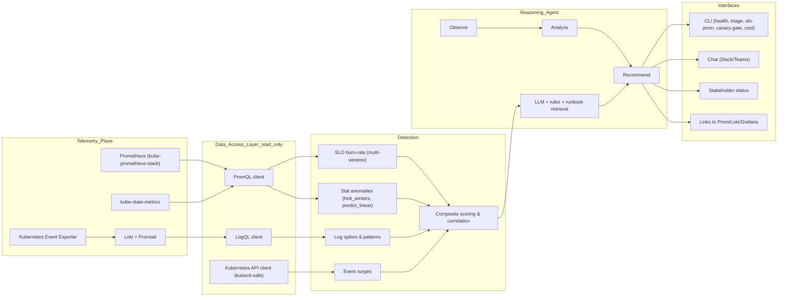

# AI On‑Call Copilot — Architecture & README Scaffold

A compact, one‑page architecture + a README skeleton to build an **agentic on‑call copilot** that detects anomalies in **cluster health (metrics/events)** and **logs**, then suggests next checks and drafts stakeholder updates.

---

## Architecture (high level)



> **Security**: least‑privilege RBAC; short‑lived tokens; redaction; read‑only by default.

---

## README (scaffold)

### 1) Overview
**AI On‑Call Copilot** observes Prometheus metrics, Kubernetes events, and logs (Loki/ELK) to detect anomalies, reason about likely causes, and recommend next checks—then drafts a concise stakeholder update. Actions are **read‑only** by default; any changes require a human in the loop.

### 2) Key Components
- **Telemetry plane**: Prometheus (or kube‑prometheus‑stack), kube‑state‑metrics, Loki + Promtail, Kubernetes Event Exporter.
- **Data access**: tiny HTTP clients for PromQL/LogQL + a safe `kubectl` wrapper (list/describe/events only).
- **Detection**: SLO burn (multi‑window), statistical PromQL (`holt_winters`, `predict_linear`), log spikes/new‑error patterns, event surges; composite scoring.
- **Reasoning Agent**: rules + LLM with runbook retrieval (RAG) to propose next checks and draft updates.
- **Interfaces**: CLI commands and/or chat bot; deep links to Grafana/Prometheus/Loki for evidence.

### 3) Quickstart (local dev)
1. **Cluster**: kind or Minikube.
2. **Metrics & logs**: install Prometheus & Loki stack (Helm or minimal YAML). Port‑forward Prometheus to `localhost:9090`.
3. **CLI**: run `health`, `triage`, `slo-prom`, `canary-gate`, `cost` to verify signals.
4. **Agent (optional)**: run `agent-run --once` to print TL;DR, findings, next checks, status draft.

> Keep credentials out of repo; prefer short‑lived tokens and `.env` files.

### 4) CLI (example commands)
- `health --namespace default` → pods/nodes/events + **Next checks**
- `triage --pod <name> --lines 300` → top errors + runbook suggestions
- `slo-prom --err <PromQL> --tot <PromQL> --window-minutes 5 --slo-target 0.995` → live burn rate
- `canary-gate --co … --ct … --bo … --bt … --cp95 … --bp95 …` → Continue/Hold with reasons
- `cost --namespace <ns>` → crash/backoff waste, missing limits, skewed limits:requests, scheduling issues

### 5) Configuration & Policy
- **SLOs**: target availability, windows (5/30/60m), burn thresholds.
- **Canary policy**: min sample size, max p95/p99 regression, min success‑delta.
- **Runbooks**: mapping (event/log signature → next checks & rollback steps).
- **Ownership**: namespace/app → team (for routing/escalation).

### 6) Security & Governance
- RBAC: read‑only cluster roles; non‑resource `/metrics` access for apiserver scraping.
- Token lifetime & rotation; audit logs; PII redaction; retention/cost controls (log sampling, label cardinality limits).

### 7) Extensibility
- Detectors are plugins (metrics/logs/events/custom). Add cloud hooks (node autoscaler, load balancer health) or eBPF/system signals as needed.

### 8) Repo Layout (suggested)
```
/cli.py                     # Typer CLI (health, triage, slo-prom, canary-gate, cost, agent-run)
/copilot/tools/             # prom.py (PromQL), log.py (LogQL), kubectl_safe.py, slo.py, canary.py
/copilot/workflows/         # health.py, triage.py, cost.py, events.py, detect.py
/agent/                     # agent_loop.py, runbook_rag.py, policy/
/policies/                  # slo.json, canary_policy.json, runbooks/
/docs/                      # architecture.md, queries/
```

### 9) Minimal Agent Loop (pseudocode)
```python
sig = collect_signals(prom, loki, k8s)
findings = detect(sig)            # burn, stats, logs, events → composite
report = reason(findings, runbooks)  # LLM + rules → TL;DR, next checks, status
emit(report, channels=[cli, slack])
```

### 10) Roadmap (examples)
- Wire `canary-prom` (metrics‑driven canary vs baseline).
- Add log new‑pattern detection + similarity search.
- Confidence scoring + auto‑link evidence (saved queries, pod names, timestamps).
- Optional: create tickets/slack threads; still require human approval for any change.

---

**How to use this page**: paste the Mermaid block into your repo’s README (GitHub renders it), and copy the sections above into your `README.md`. Replace placeholders with your actual commands/filenames as you implement.


---

## Sample Helm `values.yaml`

> Copy these into your repo (e.g., `deploy/values-kps.yaml` and `deploy/values-loki.yaml`). They’re minimal but production‑shaped for local/dev.

### A) kube‑prometheus‑stack (`values-kps.yaml`)
```yaml
grafana:
  enabled: false  # enable if you want dashboards

kubeApiServer:
  enabled: true   # ensure apiserver target is scraped

rbac:
  create: true

prometheus:
  service:
    type: ClusterIP
  prometheusSpec:
    retention: 2d
    scrapeInterval: 15s
    evaluationInterval: 15s
    resources:
      requests:
        cpu: 100m
        memory: 256Mi
    ruleSelectorNilUsesHelmValues: false
    serviceMonitorSelectorNilUsesHelmValues: false
    podMonitorSelectorNilUsesHelmValues: false

# Optional: burn‑rate alerts (API server as an example, 99.5% SLO)
additionalPrometheusRulesMap:
  slo-burn:
    groups:
      - name: slo-burn
        rules:
          - alert: HighErrorBudgetBurn_5m_99_5
            for: 2m
            labels:
              severity: page
              window: "5m"
            annotations:
              summary: "High error‑budget burn (5m window)"
              runbook: "Check recent deploys/canary; inspect logs and probes"
            expr: |
              (
                sum(rate(apiserver_request_total{code=~"5.."}[5m]))
                /
                sum(rate(apiserver_request_total[5m]))
              )
              / ( (1 - 0.995) * (5 / 43200) ) > 6
          - alert: ErrorBudgetBurn_30m_99_5
            for: 10m
            labels:
              severity: warn
              window: "30m"
            annotations:
              summary: "Elevated error‑budget burn (30m)"
            expr: |
              (
                sum(rate(apiserver_request_total{code=~"5.."}[30m]))
                /
                sum(rate(apiserver_request_total[30m]))
              )
              / ( (1 - 0.995) * (30 / 43200) ) > 1
```

**Install**
```bash
helm repo add prometheus-community https://prometheus-community.github.io/helm-charts
helm repo update
helm upgrade --install mon prometheus-community/kube-prometheus-stack \
  -n monitoring --create-namespace -f deploy/values-kps.yaml
# Port-forward Prometheus:
kubectl -n monitoring port-forward svc/mon-kube-prometheus-stack-prometheus 9090:9090
```

### B) Loki stack (`values-loki.yaml`)
```yaml
grafana:
  enabled: false  # set true if you want Grafana from this chart

prometheus:
  enabled: false  # we already have Prometheus from kube‑prometheus‑stack

loki:
  enabled: true
  auth_enabled: false
  service:
    type: ClusterIP
  config:
    server:
      http_listen_port: 3100
    common:
      path_prefix: /var/loki
      storage:
        filesystem:
          chunks_directory: /var/loki/chunks
          rules_directory: /var/loki/rules
    schema_config:
      configs:
        - from: 2020-10-24
          store: boltdb-shipper
          object_store: filesystem
          schema: v11
          index:
            prefix: index_
            period: 24h
    ruler:
      enable_api: true
      alertmanager_url: http://mon-kube-prometheus-stack-alertmanager.monitoring:9093
      storage:
        type: local
        local:
          directory: /var/loki/rules

promtail:
  enabled: true
  config:
    server:
      http_listen_port: 9080
      grpc_listen_port: 0
    positions:
      filename: /var/log/positions.yaml
    clients:
      - url: http://loki:3100/loki/api/v1/push
    scrape_configs:
      - job_name: kubernetes-pods
        pipeline_stages:
          - cri: {}
          # example redaction (tweak to your needs)
          - replace:
              expression: '(Authorization: )Bearer [A-Za-z0-9-._~+/]+=*'
              replace: '$1<redacted>'
        kubernetes_sd_configs:
          - role: pod
        relabel_configs:
          - source_labels: [__meta_kubernetes_pod_node_name]
            target_label: node
          - source_labels: [__meta_kubernetes_namespace]
            target_label: namespace
          - source_labels: [__meta_kubernetes_pod_name]
            target_label: pod
          - source_labels: [__meta_kubernetes_container_name]
            target_label: container
          - action: replace
            replacement: /var/log/pods/*/*/*.log
            target_label: __path__
```

**Install**
```bash
helm repo add grafana https://grafana.github.io/helm-charts
helm repo update
helm upgrade --install loki grafana/loki-stack -n logging --create-namespace -f deploy/values-loki.yaml
# Port-forward Loki (if you want to hit the API directly):
kubectl -n logging port-forward svc/loki 3100:3100
```

> **Notes**
> - These values are conservative for local/dev. For production, add persistence and tune retention.
> - If the kube‑prometheus‑stack service name differs (chart version change), adjust the port‑forward svc name accordingly.
> - The burn‑rate alerts use the API server as a simple example; point them at your app’s HTTP metrics once available.

